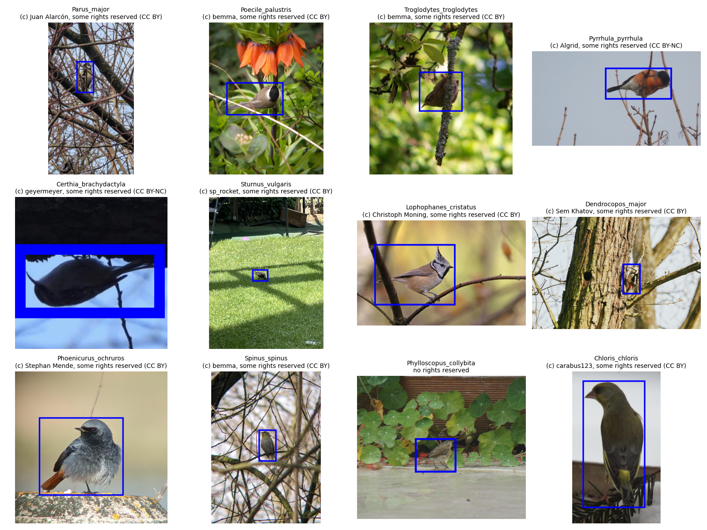
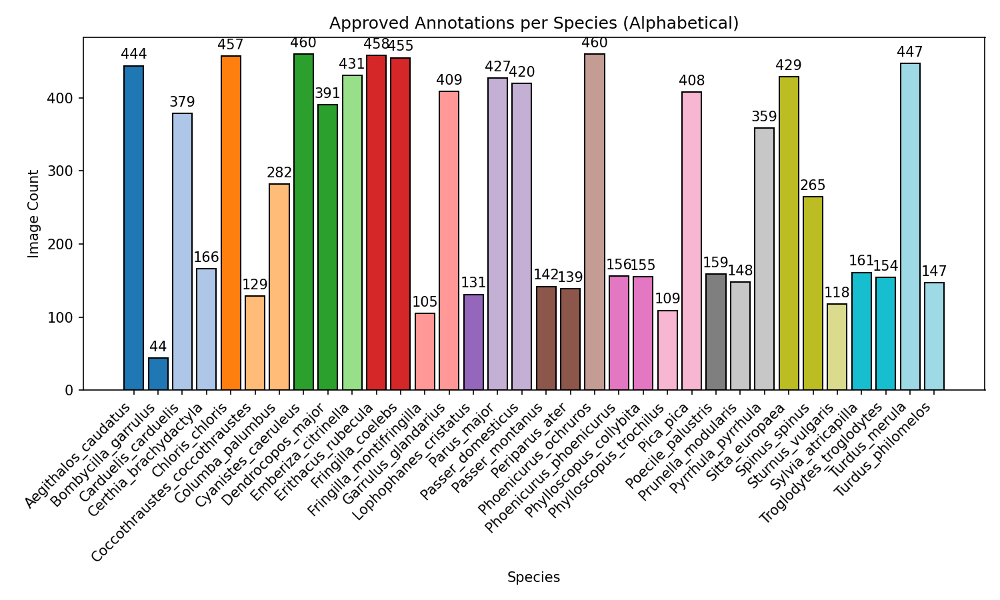
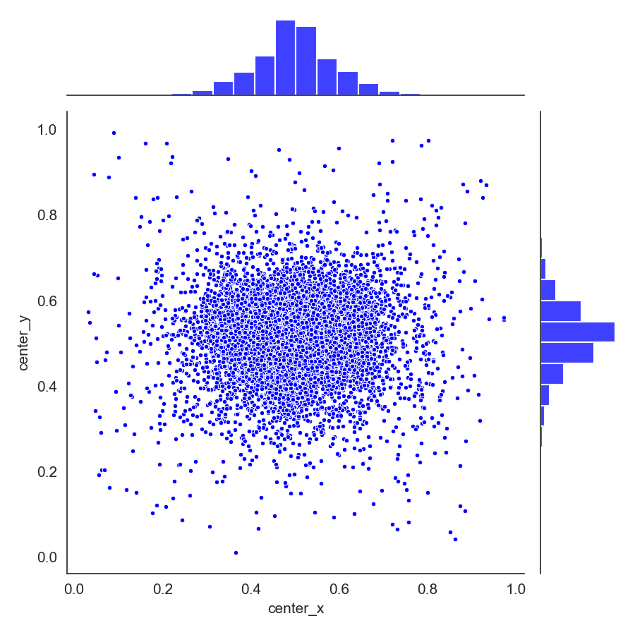
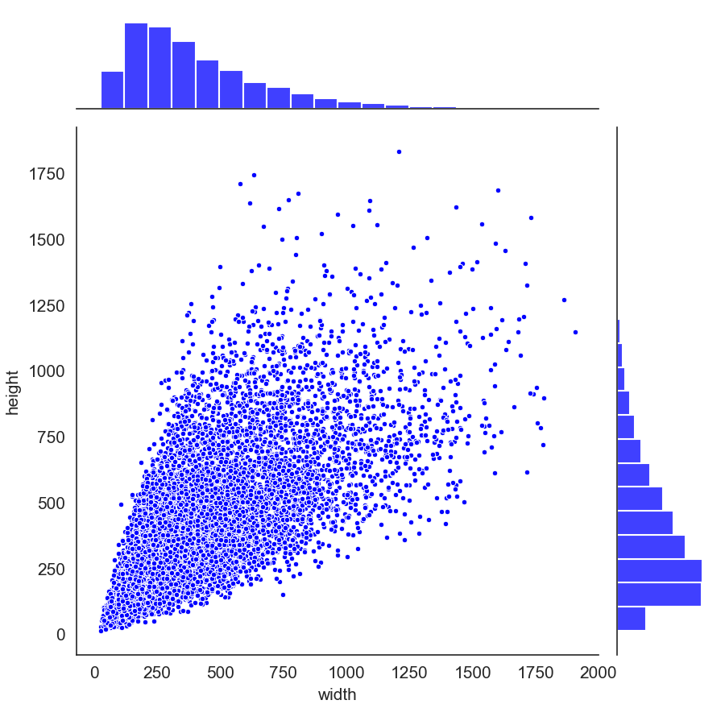

# WatchMyBirds-Data

This dataset (7341 annotated images) is designed to train the models behind [**WatchMyBirds**](https://github.com/arminfabritzek/WatchMyBirds) – a lightweight, customizable object detection system tailored for real-time monitoring. Built with PyTorch and TensorFlow, WatchMyBirds supports live video streaming, automatic frame capture based on detection criteria, and Telegram integration for timely notifications. Images in the dataset may contain different species, and all annotations are provided in COCO format.

Built for **hobbyists, researchers, and wildlife enthusiasts**, WatchMyBirds makes real-time monitoring **accessible and powerful**. 🚀  

---

---

---

---

---

## Dataset CSV Preview (First 4 Lines)

| original_url                                                                  | attribution                                              | image_hash                       | approved_annotation                                                                                                                                                                                                                                                                                                                                 |
|:------------------------------------------------------------------------------|:---------------------------------------------------------|:---------------------------------|:----------------------------------------------------------------------------------------------------------------------------------------------------------------------------------------------------------------------------------------------------------------------------------------------------------------------------------------------------|
| https://inaturalist-open-data.s3.amazonaws.com/photos/462297343/original.jpeg | (c) Christoph Moning, some rights reserved (CC BY)       | 7b79edafc34b4ad6f33ae605c6f93dad | {"annotations": [{"id": 153141511001, "image_id": 153141511, "category_id": 12, "bbox": [43.0, 236.0, 1481.0, 756.0], "area": 1119636.0, "iscrowd": 0}], "images": [{"id": 153141511, "file_name": "Parus_major_257683672_462297343.jpeg", "width": 2048, "height": 1280}], "categories": [{"id": 12, "name": "Parus_major"}]}                      |
| https://inaturalist-open-data.s3.amazonaws.com/photos/113871045/original.jpeg | (c) bemma, some rights reserved (CC BY)                  | 0e9997b012af351690fff11ee646e930 | {"annotations": [{"id": 153139985001, "image_id": 153139985, "category_id": 17, "bbox": [739.0000000000001, 835.0, 126.0, 151.0], "area": 19026.0, "iscrowd": 0}], "images": [{"id": 153139985, "file_name": "Pyrrhula_pyrrhula_70085759_113871045.jpeg", "width": 1536, "height": 2048}], "categories": [{"id": 17, "name": "Pyrrhula_pyrrhula"}]} |
| https://inaturalist-open-data.s3.amazonaws.com/photos/31623296/original.jpeg  | (c) Alexis Tinker-Tsavalas, some rights reserved (CC BY) | 60a08341f0d7ff50c18e411d14e92a18 | {"annotations": [{"id": 153136239001, "image_id": 153136239, "category_id": 5, "bbox": [851.0, 559.0, 497.0, 486.0], "area": 241542.0, "iscrowd": 0}], "images": [{"id": 153136239, "file_name": "Cyanistes_caeruleus_20490722_31623296.jpeg", "width": 2048, "height": 1538}], "categories": [{"id": 5, "name": "Cyanistes_caeruleus"}]}           |

---

## Acknowledgements

This project uses **Label Studio** – provided free through the Academic Program by HumanSignal, Inc.  

---
