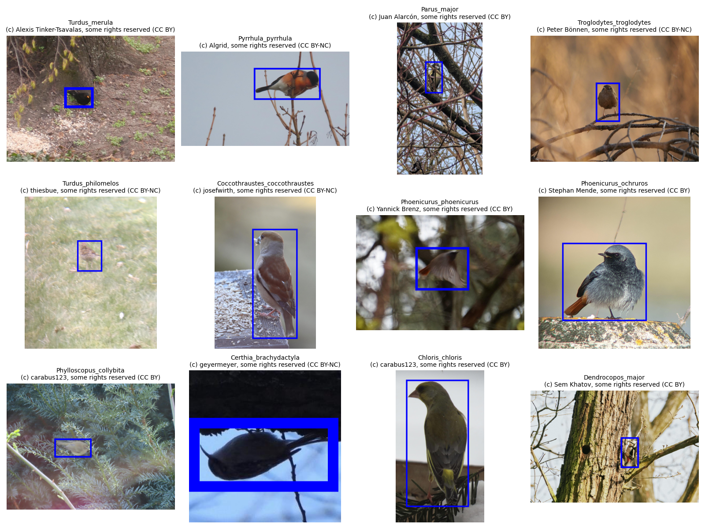

# WatchMyBirds-Data

## Scripts overview

- **02_preannotate_v0x.py**
Automates zero-shot preannotation of bird bounding boxes: reads the metadata CSV, processes images in batches using Grounding DINO (and optional SAM) with ensemble prompts, applies NMS and nested-box filtering (and SAM refinement if enabled), then writes COCO-format annotations back into the CSV.

## Results

This dataset (14277 annotated images) is designed to train the models behind [**WatchMyBirds**](https://github.com/arminfabritzek/WatchMyBirds) – a lightweight, customizable object detection system tailored for real-time monitoring. Built with PyTorch and TensorFlow, WatchMyBirds supports live video streaming, automatic frame capture based on detection criteria, and Telegram integration for timely notifications. Images in the dataset may contain different species, and all annotations are provided in COCO format.

Built for **hobbyists, researchers, and wildlife enthusiasts**, WatchMyBirds makes real-time monitoring **accessible and powerful**. 🚀  

---

---

---

---

---

## Dataset CSV Preview (First 4 Lines)

| original_url                                                                  | attribution                                   | image_hash                       | approved_annotation                                                                                                                                                                                                                                                                                                                                                                             |
|:------------------------------------------------------------------------------|:----------------------------------------------|:---------------------------------|:------------------------------------------------------------------------------------------------------------------------------------------------------------------------------------------------------------------------------------------------------------------------------------------------------------------------------------------------------------------------------------------------|
| https://inaturalist-open-data.s3.amazonaws.com/photos/362281749/original.jpg  | (c) A. Johann, some rights reserved (CC BY)   | 4dc12ba6c99f2ac680a6d5836e0284b8 | {"annotations": [{"id": 153141760001, "image_id": 153141760, "category_id": 11, "bbox": [694.0000000000001, 675.0, 503.0, 307.0], "area": 154421.0, "iscrowd": 0}], "images": [{"id": 153141760, "file_name": "Erithacus_rubecula_204929557_362281749.jpg", "width": 2025, "height": 1625}], "categories": [{"id": 11, "name": "Erithacus_rubecula"}]}                                          |
| https://inaturalist-open-data.s3.amazonaws.com/photos/353597580/original.jpg  | (c) Sem Khatov, some rights reserved (CC BY)  | ffadf4c44663dd536caac9d0f963f46d | {"annotations": [{"id": 153133966001, "image_id": 153133966, "category_id": 11, "bbox": [665.0, 288.0, 282.0, 496.99999999999994], "area": 140153.99999999997, "iscrowd": 0}], "images": [{"id": 153133966, "file_name": "Erithacus_rubecula_200419242_353597580.jpg", "width": 2048, "height": 1152}], "categories": [{"id": 11, "name": "Erithacus_rubecula"}]}                               |
| https://inaturalist-open-data.s3.amazonaws.com/photos/459946962/original.jpeg | (c) Stefan Haag, some rights reserved (CC BY) | ec1fec3706ce31abbcab0601581501d9 | {"annotations": [{"id": 153139040001, "image_id": 153139040, "category_id": 9, "bbox": [42.99999999999996, 152.30874006810444, 423.00000000000006, 203.69125993189593], "area": 86161.402951192, "iscrowd": 0}], "images": [{"id": 153139040, "file_name": "Dendrocopos_major_256519615_459946962.jpeg", "width": 572, "height": 543}], "categories": [{"id": 9, "name": "Dendrocopos_major"}]} |

---

## Acknowledgements

This project uses **Label Studio** – provided free through the Academic Program by HumanSignal, Inc.  

---
